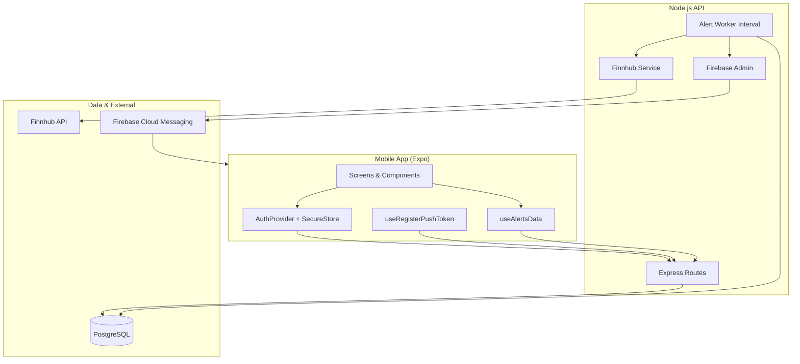
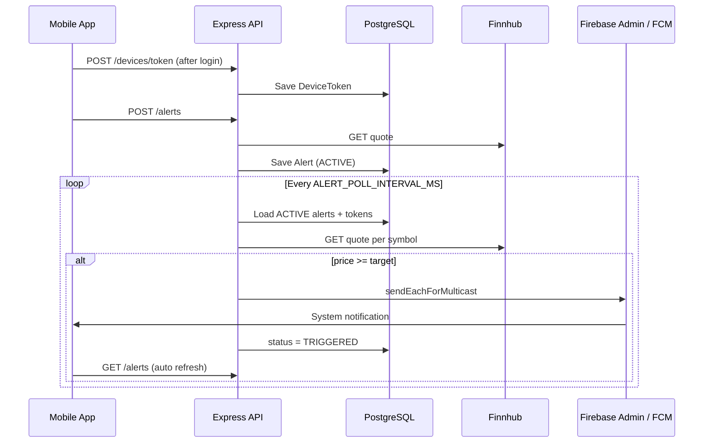

# Stock Watch — Detailed Code Explanation

This document explains how the **Stock Watch** application is designed and implemented. It is intended for technical reviewers, clients, and future maintainers who need to understand what the code does and why it is structured this way.

---

## Table of Contents

1. [Project Overview](#1-project-overview)
2. [Requirements Mapping](#2-requirements-mapping)
3. [High-Level Architecture](#3-high-level-architecture)
4. [Repository Structure](#4-repository-structure)
5. [Backend API (`apps/api`)](#5-backend-api-appsapi)
6. [Mobile App (`apps/mobile`)](#6-mobile-app-appsmobile)
7. [Push Notifications (Firebase)](#7-push-notifications-firebase)
8. [Price Alert Worker](#8-price-alert-worker)
9. [Database Design](#9-database-design)
10. [Docker & Deployment](#10-docker--deployment)
11. [Security Considerations](#11-security-considerations)
12. [Key Design Decisions](#12-key-design-decisions)
13. [File Reference Guide](#13-file-reference-guide)

---

## 1. Project Overview

**Stock Watch** is a full-stack stock price alert application built as a monorepo:

| Layer | Technology |
|--------|------------|
| Mobile | Expo, React Native, React Navigation |
| API | Node.js, Express, TypeScript |
| Database | PostgreSQL, Prisma ORM |
| Market data | Finnhub REST API |
| Push notifications | Firebase Cloud Messaging (FCM) |
| Deployment | Docker Compose (local), Render (hosted API) |

Users can register, log in, browse stocks, view charts, create price alerts, and receive push notifications when a stock price crosses their target threshold.

---

## 2. Requirements Mapping

| Requirement | Implementation |
|-------------|----------------|
| User login | JWT-based auth (`/auth/login`, `/auth/register`) with secure session storage on mobile |
| Create stock price alert | `POST /alerts` + `CreateAlertScreen` |
| List of stocks | `GET /stocks` + `StocksScreen` with auto-refresh |
| Stock chart | `GET /stocks/:symbol` + `StockDetailScreen` (Finnhub daily candles) |
| Firebase push when price exceeds alert | Background worker + FCM via Firebase Admin SDK |
| **Extra:** Docker deployment | `docker-compose.yml` + `apps/api/Dockerfile` |

---

## 3. High-Level Architecture



**Request flow (typical):**

1. User logs in on mobile → API returns JWT.
2. Mobile stores JWT and attaches it to protected requests.
3. User creates an alert → API saves it as `ACTIVE` with current price from Finnhub.
4. Background worker polls Finnhub every N seconds.
5. When `currentPrice >= targetPrice`, API sends FCM push and marks alert `TRIGGERED`.
6. Mobile receives push, refetches alerts, and animates badge to `TRIGGERED`.

---

## 4. Repository Structure

```text
Designli/
├── apps/
│   ├── api/                    # Express backend
│   │   ├── prisma/
│   │   │   ├── schema.prisma     # Database models
│   │   │   ├── seed.ts           # Demo user seed
│   │   │   └── migrations/
│   │   ├── src/
│   │   │   ├── config/           # Environment validation
│   │   │   ├── routes/           # HTTP endpoints
│   │   │   ├── services/         # Business logic (alerts, finnhub)
│   │   │   ├── lib/              # Prisma, Firebase
│   │   │   ├── middleware/       # Auth, errors
│   │   │   └── utils/            # JWT, passwords, helpers
│   │   └── Dockerfile
│   └── mobile/                   # Expo React Native app
│       ├── src/
│       │   ├── api/              # Axios client
│       │   ├── screens/          # UI screens
│       │   ├── hooks/            # Push + alerts sync
│       │   ├── components/       # Reusable UI
│       │   └── providers/        # Auth context
│       ├── app.json              # Expo config + Firebase plugin
│       └── google-services.json  # Android FCM config
├── docker-compose.yml            # Postgres + API containers
├── package.json                  # npm workspaces root
├── README.md                     # Setup instructions
└── CODE_EXPLANATION.md           # This document
```

The root `package.json` uses **npm workspaces** so `api` and `mobile` share one lockfile and can be run with `npm run dev:api` / `npm run dev:mobile`.

---

## 5. Backend API (`apps/api`)

### 5.1 Server bootstrap

**File:** `src/server.ts`

- Creates the Express app via `createApp()`.
- Starts HTTP server on `PORT` (default `4000`, overridden by Render).
- Starts the **alert worker** interval.
- Handles graceful shutdown (stops worker, disconnects Prisma).

### 5.2 Application wiring

**File:** `src/app.ts`

| Route prefix | Auth required | Purpose |
|--------------|---------------|---------|
| `GET /` | No | Service identity |
| `GET /health` | No | Health + Firebase config flag |
| `/auth` | Mixed | Register, login, me |
| `/stocks` | No | Public market data |
| `/alerts` | Yes | List/create user alerts |
| `/devices` | Yes | Register FCM device tokens |

CORS is configured from `WEB_ORIGIN`. JSON body parsing is enabled globally.

### 5.3 Environment configuration

**File:** `src/config/env.ts`

All required settings are validated at startup with **Zod**. If any required variable is missing or invalid, the server fails fast with a clear error message.

Required variables:

- `DATABASE_URL`
- `JWT_SECRET` (min 12 characters)
- `FINNHUB_API_KEY`

Optional (push notifications):

- `FIREBASE_PROJECT_ID`
- `FIREBASE_CLIENT_EMAIL`
- `FIREBASE_PRIVATE_KEY`

### 5.4 Authentication

**Files:** `src/routes/auth.ts`, `src/middleware/auth.ts`, `src/utils/jwt.ts`, `src/utils/password.ts`

**Registration (`POST /auth/register`):**

1. Validates email, password (min 6 chars), and name.
2. Rejects duplicate emails (409).
3. Hashes password with **bcrypt**.
4. Creates user in PostgreSQL.
5. Returns JWT + user profile.

**Login (`POST /auth/login`):**

1. Finds user by normalized email.
2. Compares password hash.
3. Returns JWT on success, 401 on failure.

**Protected routes:**

- Client sends `Authorization: Bearer <token>`.
- `requireAuth` middleware verifies JWT and attaches `req.auth` (`userId`, `email`, `name`).

### 5.5 Stocks & market data

**Files:** `src/routes/stocks.ts`, `src/services/finnhub.ts`, `src/constants/defaultStocks.ts`

**`GET /stocks`**

- Fetches live quotes for a fixed list: AAPL, AMZN, GOOGL, MSFT, META, NVDA, NFLX, TSLA.
- Uses Finnhub `/quote` endpoint.
- Returns normalized objects (price, change, percent change, etc.).

**`GET /stocks/:symbol`**

- Fetches quote + ~30 days of **daily candles** (`resolution: D`).
- If candle API fails (e.g. free-tier limits), returns empty `candles[]` instead of failing the whole request — chart still shows quote data.

### 5.6 Alerts API

**File:** `src/routes/alerts.ts`

**`GET /alerts`** — Returns all alerts for the logged-in user, newest first.

**`POST /alerts`** — Creates a new alert:

```json
{ "symbol": "AAPL", "targetPrice": 100 }
```

- Symbol is uppercased.
- Current price is fetched from Finnhub at creation time.
- Status is set to `ACTIVE`.

### 5.7 Device tokens API

**File:** `src/routes/devices.ts`

**`POST /devices/token`**

```json
{ "token": "<fcm-device-token>", "platform": "android" }
```

- Upserts token (unique per token string).
- Associates token with the authenticated user.
- Used later by the alert worker to send push notifications.

### 5.8 Error handling

**File:** `src/middleware/errorHandler.ts`

- Centralized JSON error responses.
- Zod validation errors return 400 with field details.
- Custom `HttpError` for known status codes (401, 404, 409, etc.).

---

## 6. Mobile App (`apps/mobile`)

### 6.1 Entry & navigation

**Files:** `App.tsx`, `index.ts`, `src/navigation/types.ts`

- `AuthProvider` wraps the app for global session state.
- React Navigation **native stack** switches between auth screens and main app based on session.
- `useRegisterPushToken` runs after login to register FCM token with API.

**Screens:**

| Screen | Purpose |
|--------|---------|
| `LoginScreen` / `RegisterScreen` | Authentication |
| `StocksScreen` | Stock list + market summary |
| `StockDetailScreen` | Quote + line chart |
| `AlertsScreen` | List alerts with live status updates |
| `CreateAlertScreen` | Form to create alert (symbol picker) |

### 6.2 API client

**File:** `src/api/client.ts`

- Axios instance with `baseURL` from `EXPO_PUBLIC_API_URL`.
- Fallback: `http://10.0.2.2:4000` (Android emulator → host machine).
- Production APK should be built with hosted URL, e.g. `https://stock-watch-monorepo.onrender.com`.

### 6.3 Session management

**File:** `src/providers/AuthProvider.tsx`

- On launch, restores session from storage.
- **Native:** `expo-secure-store` (encrypted).
- **Web:** `localStorage` (dev only).
- Exposes `login`, `register`, `logout` to screens.

### 6.4 Stocks screen — live refresh

**File:** `src/screens/StocksScreen.tsx`

- Loads stocks on mount and every **10 seconds**.
- Pull-to-refresh supported.
- Visual countdown/progress for next refresh.
- Computes market summary (advancing vs declining).

### 6.5 Alerts screen — real-time UX

**Files:** `src/screens/AlertsScreen.tsx`, `src/hooks/useAlertsData.ts`, `src/components/AlertListItem.tsx`, `src/components/AlertStatusBadge.tsx`

The alerts list stays in sync without manual refresh through **`useAlertsData`**:

| Trigger | Behavior |
|---------|----------|
| Screen focus | Silent refetch |
| Every 15s (while focused) | Silent poll |
| FCM received (`type: price-alert`) | Silent refetch |
| User taps notification | Refetch |
| App returns to foreground | Refetch |

When status changes `ACTIVE` → `TRIGGERED`:

- **`AlertStatusBadge`** plays a spring scale + glow animation.
- **`AlertListItem`** pulses card border/background green.

### 6.6 Push token registration

**File:** `src/hooks/useRegisterPushToken.ts`

After login:

1. Checks platform (skips web; allows Android emulator in dev builds).
2. Skips **Expo Go on Android** (remote push not supported).
3. Creates Android notification channel `price-alerts`.
4. Requests notification permission.
5. Calls `getDevicePushTokenAsync()` for native FCM token.
6. Sends token to `POST /devices/token`.

**File:** `app.json`

- `expo-notifications` plugin.
- `googleServicesFile` for Android FCM.

---

## 7. Push Notifications (Firebase)

### 7.1 End-to-end flow



### 7.2 Backend — Firebase Admin

**File:** `src/lib/firebase.ts`

- Initializes Firebase Admin only if all three Firebase env vars are set.
- `sendPriceAlertNotification()` sends multicast message with:
  - **notification** title/body (visible in tray)
  - **data** payload (`type: price-alert`, symbol, prices)
  - **android** high priority + channel `price-alerts`
- Logs per-token failures for debugging.

### 7.3 Mobile — receiving notifications

**File:** `App.tsx`

- Sets `setNotificationHandler` to show banner/sound when app is in foreground.
- Creates Android channel `price-alerts` (required on Android 8+).

**File:** `src/hooks/useAlertsData.ts`

- Listens for incoming notifications and refreshes alert list when `data.type === "price-alert"`.

### 7.4 Important behavior notes

- Only **ACTIVE** alerts are evaluated. Once **TRIGGERED**, the worker does not send again for that alert.
- `notificationSentAt` is set only when at least one FCM send succeeds.
- If Firebase env vars are missing, alerts still trigger in DB but push is skipped (`notificationsConfigured: false` on `/health`).

---

## 8. Price Alert Worker

**File:** `src/services/alerts.ts`

**Function:** `evaluateActiveAlerts()`

1. Query all alerts with `status = ACTIVE`, including user's `deviceTokens`.
2. For each alert, fetch latest quote (cached per symbol per run).
3. If `currentPrice < targetPrice` → update `currentPrice` only, stay ACTIVE.
4. If `currentPrice >= targetPrice`:
   - Send FCM to all user device tokens.
   - Log success/skip/failure.
   - Update alert: `TRIGGERED`, `triggeredAt`, `notificationSentAt` (if sent).

**Function:** `startAlertWorker()`

- Runs `evaluateActiveAlerts()` on interval (`ALERT_POLL_INTERVAL_MS`, default 60000 ms).
- Started from `server.ts` when API boots.
- Errors are logged; worker keeps running.

---

## 9. Database Design

**File:** `prisma/schema.prisma`

### User

| Field | Description |
|-------|-------------|
| id | CUID primary key |
| email | Unique, lowercase |
| passwordHash | bcrypt hash |
| name | Display name |

Relations: `alerts[]`, `deviceTokens[]`

### Alert

| Field | Description |
|-------|-------------|
| symbol | Stock ticker (e.g. AAPL) |
| targetPrice | User threshold |
| currentPrice | Last known price from worker/API |
| status | `ACTIVE` or `TRIGGERED` |
| triggeredAt | When threshold was crossed |
| notificationSentAt | When FCM succeeded (nullable) |

Indexes on `(userId, status)` and `(symbol, status)` for worker queries.

### DeviceToken

| Field | Description |
|-------|-------------|
| token | Unique FCM token |
| platform | `android` / `ios` |
| userId | Owner |

**Seed:** `prisma/seed.ts` creates demo user `demo@stockwatch.dev` / `Password123`.

---

## 10. Docker & Deployment

### 10.1 Local Docker Compose

**File:** `docker-compose.yml`

| Service | Image / Build | Port |
|---------|---------------|------|
| postgres | postgres:16-alpine | 5432 |
| api | `apps/api/Dockerfile` | 4000 |

Run:

```bash
docker compose up --build
```

Environment variables can be passed via shell or `.env` file (see README).

### 10.2 Dockerfile (multi-stage)

**File:** `apps/api/Dockerfile`

**Builder stage:**

1. Install workspace dependencies.
2. `prisma generate` (required before TypeScript compile).
3. `npm run build` → outputs to `dist/src/`.

**Runner stage:**

1. Production `npm install` (omit devDependencies).
2. Copy `dist`, Prisma schema, generated client.
3. On start: `prisma migrate deploy` then `node dist/src/server.js`.

### 10.3 Render deployment

Hosted API example: `https://stock-watch-monorepo.onrender.com`

| Setting | Value |
|---------|--------|
| Language | Docker |
| Dockerfile path | `apps/api/Dockerfile` |
| Docker context | `.` (repo root) |
| Database | Render PostgreSQL → `DATABASE_URL` |

Mobile production build:

```env
EXPO_PUBLIC_API_URL=https://stock-watch-monorepo.onrender.com
```

---

## 11. Security Considerations

| Area | Approach |
|------|----------|
| Passwords | bcrypt hashing, never stored plain text |
| API auth | JWT in `Authorization` header |
| Protected routes | `requireAuth` middleware on `/alerts` and `/devices` |
| Input validation | Zod schemas on all request bodies/params |
| Secrets | Environment variables only (not committed) |
| Mobile session | SecureStore on native devices |
| CORS | Configurable via `WEB_ORIGIN` |

**Recommendations for production:**

- Use strong `JWT_SECRET` and rotate periodically.
- Restrict `WEB_ORIGIN` to known app origins if needed.
- Use HTTPS only (Render provides TLS).
- Rate-limit auth endpoints if exposed publicly.

---

## 12. Key Design Decisions

### Why a monorepo?

Single repository simplifies assessment delivery: one clone, shared tooling, API + mobile versioned together.

### Why Finnhub on the server only?

API keys stay secret on the backend. Mobile never calls Finnhub directly.

### Why a background worker instead of websockets?

Finnhub free tier is REST-based. Polling active alerts on an interval is simple, reliable, and meets the assessment requirement.

### Why JWT instead of sessions?

Stateless auth scales easily on Render/Docker and fits mobile clients.

### Why silent refresh + push listener on alerts?

Push tells the user something happened; polling and notification listeners keep the UI in sync without pull-to-refresh.

### Why skip Expo Go for Android push?

Expo Go no longer supports remote push registration on Android; a **development build** or release APK is required.

---

## 13. File Reference Guide

### Backend — most important files

| File | Responsibility |
|------|----------------|
| `src/server.ts` | HTTP server + worker startup |
| `src/app.ts` | Express routes mounting |
| `src/config/env.ts` | Environment validation |
| `src/routes/auth.ts` | Login/register |
| `src/routes/stocks.ts` | Stock list & detail |
| `src/routes/alerts.ts` | CRUD alerts |
| `src/routes/devices.ts` | FCM token storage |
| `src/services/alerts.ts` | Alert worker logic |
| `src/services/finnhub.ts` | Market data integration |
| `src/lib/firebase.ts` | FCM send |
| `src/lib/prisma.ts` | Database client |
| `src/middleware/auth.ts` | JWT guard |
| `prisma/schema.prisma` | Data models |
| `Dockerfile` | Production container |

### Mobile — most important files

| File | Responsibility |
|------|----------------|
| `App.tsx` | Navigation + notification setup |
| `src/api/client.ts` | HTTP client |
| `src/providers/AuthProvider.tsx` | Session state |
| `src/hooks/useRegisterPushToken.ts` | FCM registration |
| `src/hooks/useAlertsData.ts` | Live alerts sync |
| `src/screens/StocksScreen.tsx` | Stock list UI |
| `src/screens/StockDetailScreen.tsx` | Chart UI |
| `src/screens/AlertsScreen.tsx` | Alerts list UI |
| `src/screens/CreateAlertScreen.tsx` | Create alert form |
| `src/components/AlertStatusBadge.tsx` | Animated status badge |
| `app.json` | Expo + Android FCM config |

---

## Demo Credentials

After running database seed:

```text
Email:    demo@stockwatch.dev
Password: Password123
```

---

## Related Documentation

- [README.md](./README.md) — setup, run, and delivery checklist
- [apps/api/.env.example](./apps/api/.env.example) — backend environment template
- [apps/mobile/.env.example](./apps/mobile/.env.example) — mobile environment template

---

*Document version: aligned with the Stock Watch monorepo as delivered for the Designli assessment.*
